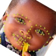
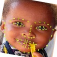
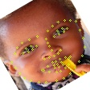
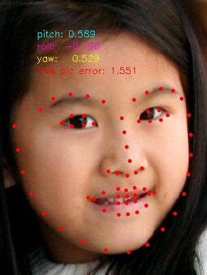
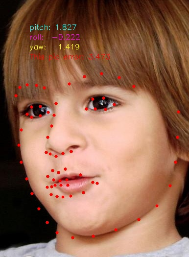
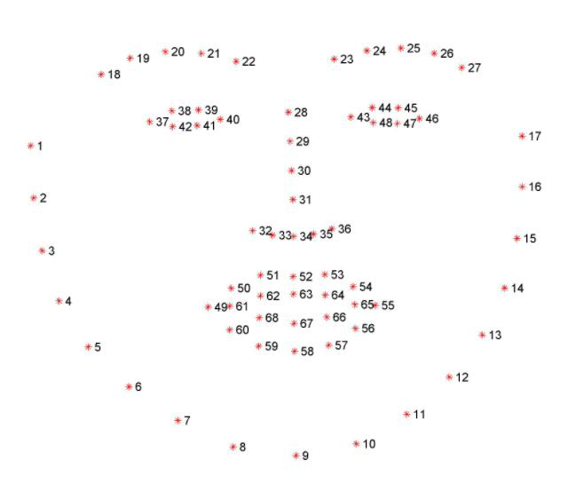

# Mobilenet-V2人脸68关键点就按测模型
*1:数据
(1): 关键点模型和人脸检测器一般配套使用：本关键点模型是基于公司训练的SSD人脸检测器的检测框，裁剪适当人脸区域之后进行训练的，
	 检测框的位置规范以公司人脸检测数据标注规范为准。
(2):是对标注的图像和数据通过自己的人脸检测器检测出人脸位置，对原始关键点进行相应变换，以去除多余背景的操作。
(3):最终数据格式：图片名 + 人脸框(x,y,w,h) + 68个关键点的x,y坐标

## 配置代码运行环境
* 读者需要先根据自己的Nvidia品牌显卡的型号，安装对应的CUDA版本。
* 根据作者的经验，Nvidia品牌20系列显卡需要安装CUDA9，否则运行代码会报错。
* 安装组件及环境：CUDA9、cudnn7.6、caffe。

### 硬件配置要求
大于等于6G显存的Nvidia品牌显卡

### 软件配置要求
各种软件版本：
* 操作系统: linux
* python: 3.6
* CUDA: 9.0
* cudnn: 7.6.1
* caffe
* opencv_python: 4.1.0

## 1.数据预处理
### 1.1 人脸检测和关键点处理
* 在文件夹`data_form/image00`文件夹中,提供了原始的部分训练图片。
*  在文件夹`data_form/bbox+landmarks00.txt`中,提供了对应训练图片的标签格式。
* 如下图所示：
* 

### 1.2 数据增强
* 在训练前先对图像进行一系列的预处理和数据增强，这里为了提升模型对于侧脸人脸图像的鲁棒性，主要对图像进行了旋转操作，在[-30,30]度范围内，每隔5度对图像进行旋转。这里选取几张可视化，便于直观了解。
*     
*       
* 

## 2.模型训练。
*网络训练文件位于文件夹`network‘中，其中也给出了人脸关键点测试标准。
## 3.模型测试。

## 4.最后给出人脸68点的分布情况。
*根据人脸关键点模型--得出人脸68关键点，以用于人脸优选和驾驶行为分析。
